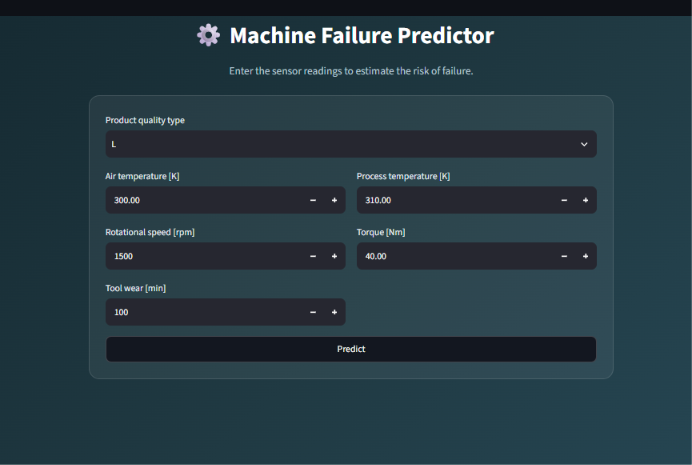
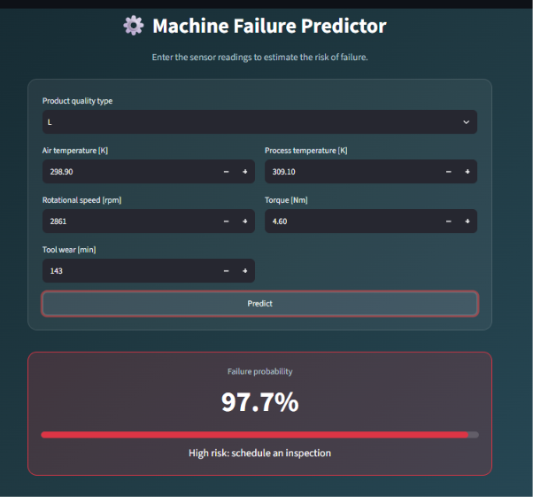
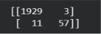

# Machine Failure Prediction System

A machine learning project that predicts whether a machine is likely to fail, based on its operating conditions. Built on the AI4I 2020 Predictive Maintenance dataset, with a Streamlit app for live predictions.

## Demo


*The input form.*


*A prediction result with the failure probability and risk message.*

The app also warns the user when an input falls outside the range of the training data, because predictions there are unreliable.

## Problem

Unexpected machine breakdowns are costly. This project uses sensor readings to flag likely failures early, so maintenance can be scheduled before something breaks.

## Dataset

- **Source:** AI4I 2020 Predictive Maintenance Dataset (UCI)
- **Size:** 10,000 records, no missing values
- **Features used:** product type, air temperature, process temperature, rotational speed, torque, tool wear
- **Target:** machine failure (0 = no failure, 1 = failure)
- **Excluded columns:** the ID columns, and the five failure-type columns (TWF, HDF, PWF, OSF, RNF), which are only known after a failure happens and would leak the answer to the model
- **Challenge:** failures are rare (3.4% of rows), so the data is heavily imbalanced

## Approach

1. **Exploratory analysis:** failed machines had higher torque and tool wear on average. 26 of the 32 machines running above 2,500 rpm failed, so these outliers were kept, not removed.
2. **Leakage prevention:** removed the five failure-type columns and the ID columns.
3. **Feature engineering:** added Power (torque x speed), Temperature difference (process - air) and Strain (tool wear x torque). Product type was one-hot encoded.
4. **Split:** 80/20 train/test split, stratified so both sets keep the 3.4% failure rate.
5. **Model comparison:** 5-fold stratified cross-validation on the training set only.
6. **Threshold tuning:** the decision threshold was set to 0.3 using out-of-fold predictions on the training set.
7. **Final evaluation:** the test set was used once, at the end.
8. **App:** a Streamlit app that applies the same feature engineering to the user's inputs.

Accuracy is not used as the main metric, because a model that always predicts "no failure" already scores 96.6%. Recall, precision and F1 on the failure class are used instead.

## Results

**Model comparison (5-fold cross-validation on the training set, default 0.5 threshold):**

| Model | Precision | Recall | F1 |
|-------|-----------|--------|----|
| Decision Tree | 0.80 | 0.76 | 0.78 |
| Random Forest | 0.98 | 0.79 | 0.87 |
| Gradient Boosting | 0.97 | 0.83 | 0.89 |

Gradient Boosting was chosen because it scored highest on recall and F1 while keeping precision high. Its lead over Random Forest is small and within the variation between folds.

**Final model on the held-out test set (Gradient Boosting, threshold 0.3):**

| Metric | Value |
|--------|-------|
| Failures caught | 57 of 68 |
| Failures missed | 11 |
| False alarms | 3 |
| Recall | 0.84 |
| Precision | 0.95 |


*Test-set confusion matrix at threshold 0.3.*

**Baseline:** a model that always predicts "no failure" gets 96.6% accuracy but catches 0 failures.

**Effect of feature engineering:** adding the three engineered features raised Random Forest recall on the test set from 0.47 to 0.79.

**Choice of threshold:** at 0.3 the model catches 6 more failures than at 0.5, at the cost of 10 more false alarms. This assumes a missed failure costs more than an unnecessary inspection.

## Error analysis

Heat dissipation (28 of 29), power (13 of 13) and overstrain (16 of 16) failures were almost always caught. Tool-wear failures were the weak spot: only 2 of 10 were caught, and they make up 8 of the 11 missed failures. The missed machines have high tool wear but ordinary torque, temperature and power, so the available sensors cannot separate them from the many worn tools that do not fail.

## Limitations

- The dataset is synthetic, so real-world performance would likely be lower.
- The test set has only 68 failures, so the reported figures are uncertain by several percentage points.
- The 0.3 threshold assumes a missed failure costs more than a false alarm. With real cost figures it should be re-tuned.
- Predictions for inputs outside the training range are unreliable.

## Project Structure

```
├── app.py                          # Streamlit prediction app
├── machine_failure_model.joblib    # Trained model, column order and threshold
├── requirements.txt                # Python dependencies
├── images/                         # Screenshots used in this README
├── data/                           # AI4I 2020 dataset (CSV)
└── notebook.ipynb                  # Training and analysis (Google Colab)
```

## How to Run

```bash
git clone https://github.com/hchauhan24/Machine-Failure-Prediction-System.git
cd Machine-Failure-Prediction-System
pip install -r requirements.txt
streamlit run app.py
```

## Tech Stack

Python, pandas, numpy, scikit-learn, joblib, Streamlit, Google Colab